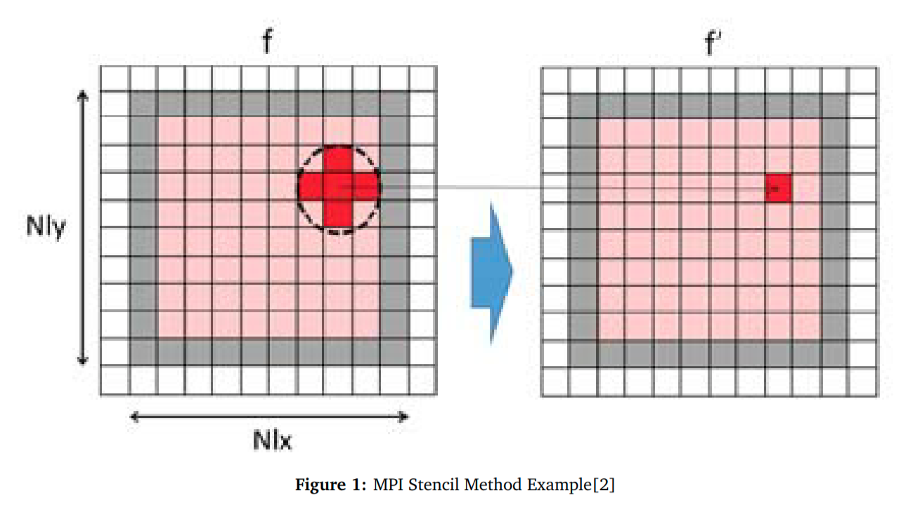
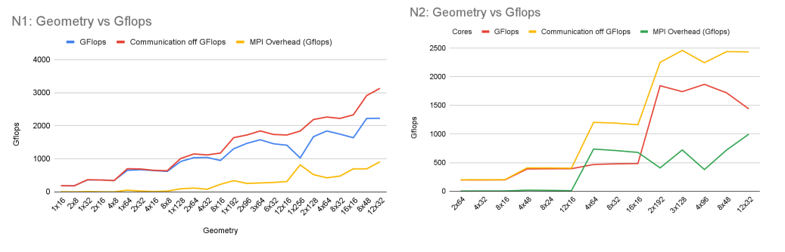

# MPI-Parallelized-Aliev-Panfilov-Simulation

Simulations play an important role in science, medicine, and engineering. In this project we perform a cardiac electrophysiology simulation, which models electrical signals in a system in which voltages vary at discrete points in time and at the discrete positions of a mesh. The simulation involves solving a coupled set of Ordinary Differential Equations (ODEs) together with a Partial Differential Equation (PDE).In this project, we make effort to parallelize the Aliev-Panfilov Cardiac simulation over multiple cores using MPI(message passing interface). This program achieves a scaling efficiency > 1.0 and peak performance of 1.96 Tflops/s using 384 cores via the use of asynchronous non-blocking communication and the exploitation of spatial and temporal locality inherent to computed elements.

Code organization
=================
* solve.cpp - implements Aliev-Panfilov Cardiac over MPI. use makefile to compile
* helper.cpp - setups initial conditons and distrbutes the problems to multiple cores

Results
=================

